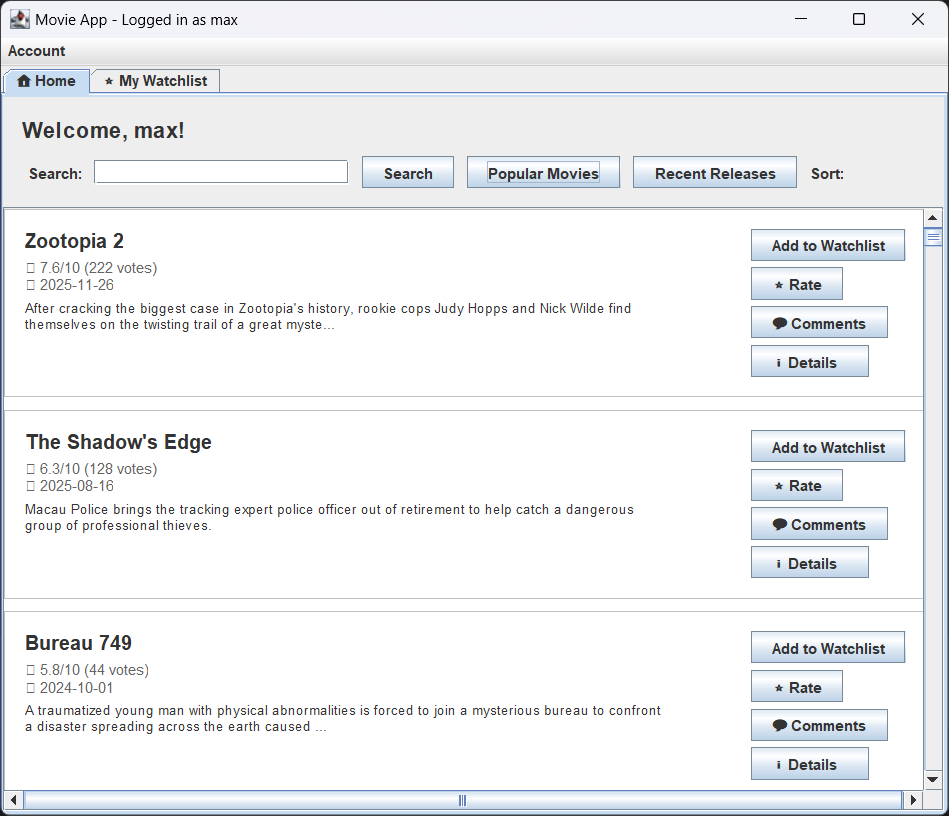
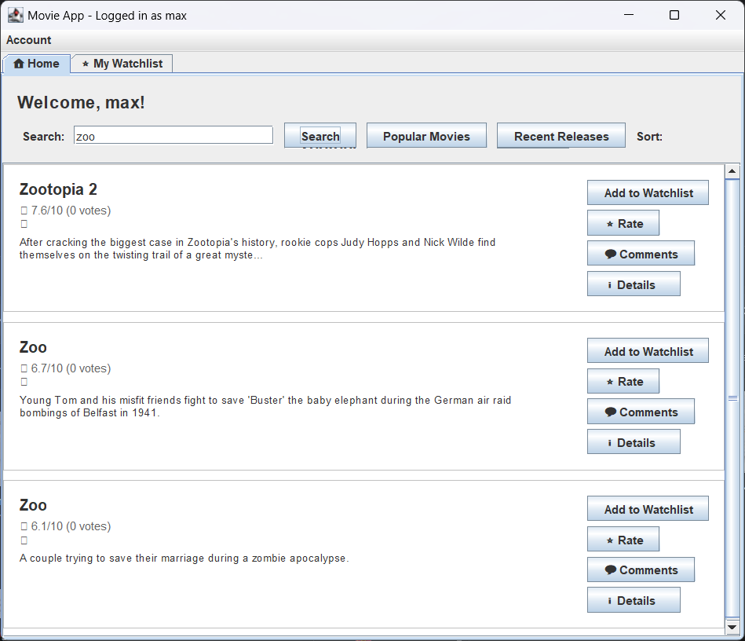
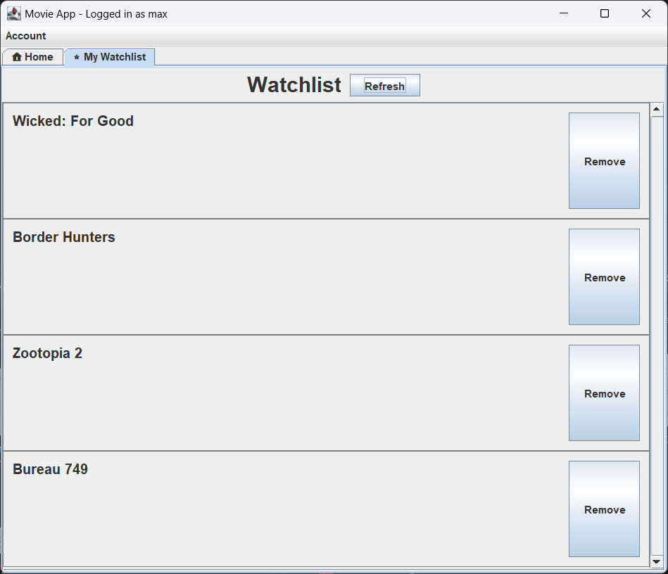
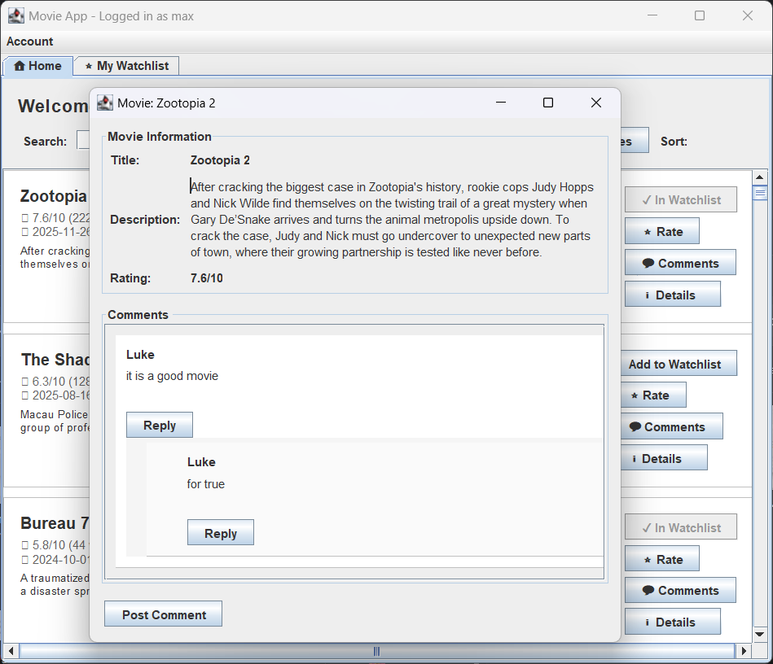
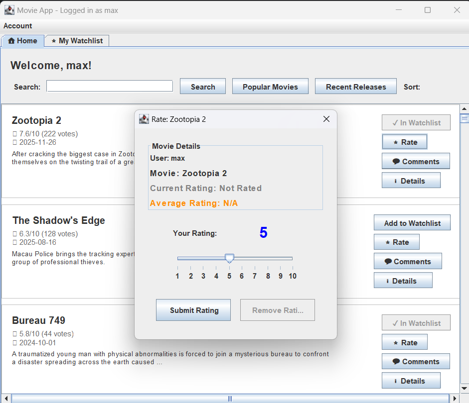

## Movies App – TUT0301-03

This repository contains a Java desktop application that allows users to explore movies, 
manage a personal watchlist, rate movies, and leave comments.  
The application is built with Java Swing and integrates with the TMDB (The Movie Database) API
to fetch real-time movie data.

## Features

- **User Accounts**
  - Create a new account
  - Log in with username and password
  - Stay logged in while using the main tabbed interface

- **Watchlist**
  - Add movies to a personal watchlist
  - Remove movies from the watchlist
  - View your watchlist in a dedicated “My Watchlist” tab

- **Ratings**
  - Rate movies and update your rating
  - See average rating for a movie

- **Comments**
  - Post comments for a specific movie
  - View comments related to a movie

- **Movie Browsing**
  - View top popular and most recent movies on the home page
  - Search for movies by keyword
  - Open a detailed movie view with description and rating

- **Searching for a Movie**
  - Enter keywords to search for movies

## Architecture Overview

The project follows a layered / clean architecture style with clear separation of concerns:

- `entity` – Core business entities such as `User`, `Movie`, `Watchlist`, `Comment`
- `use_case` – Application use cases (login, create account, search, watchlist, rating, comments, etc.)
- `interface_adapter` – Controllers, presenters, and view models that adapt use cases to the UI
- `data_access` – Data access layer for users, comments, watchlists, and TMDB API access
- `view` – Swing UI components (login screen, home page, movie list, watchlist, comment views, etc.)

## Screenshots

- Login screen
  - 
- Homepage / searching / sorting
  - 
  - 
  - 
- Watchlist view
  - 
- Comment / rating views
  - 
  - 

## Addtionl Information
The entire CA structuion will be the HomePageView connects to all controllers adn viewmodel, except the create 
and login feature. 

All view class in view pakage (except HomePage, CreateAccount, Login) are class being created for demo. 
The demo of use case are name in "UseCase*Application".

